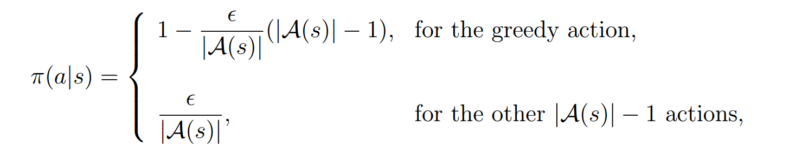
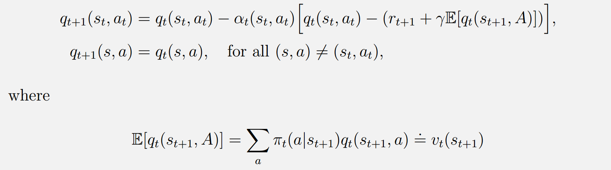
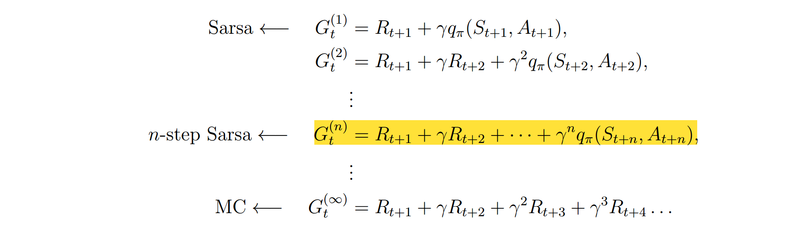
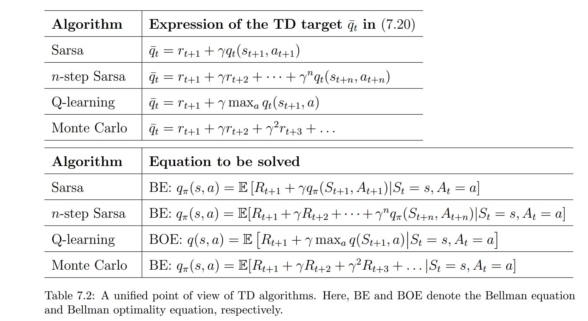
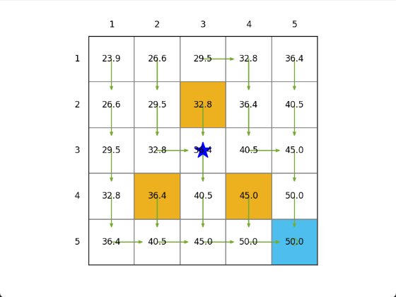
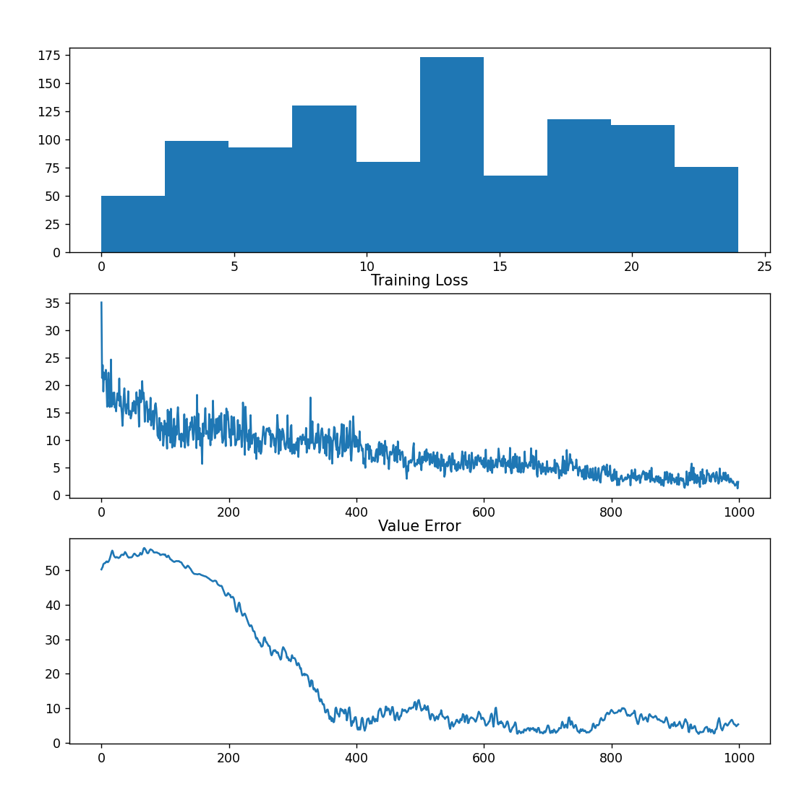
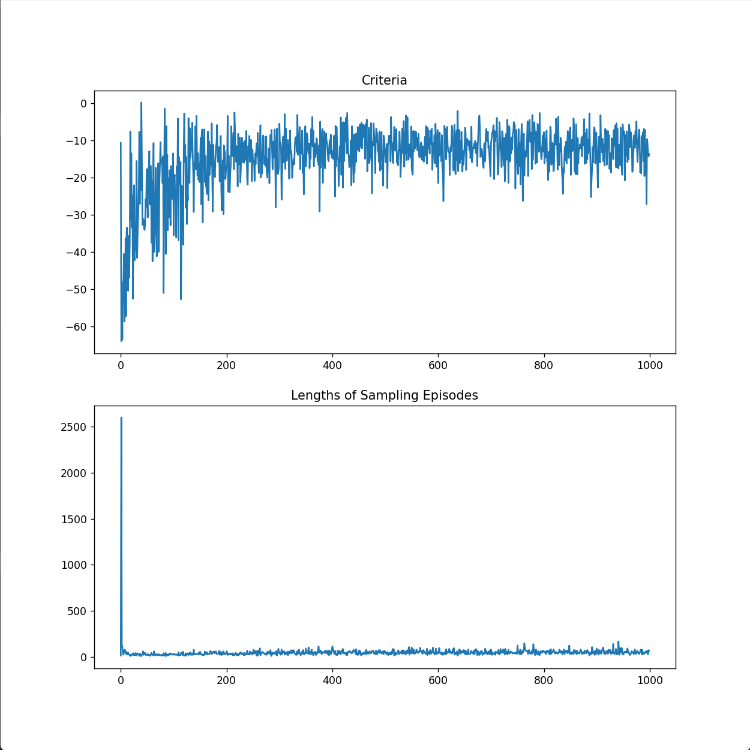
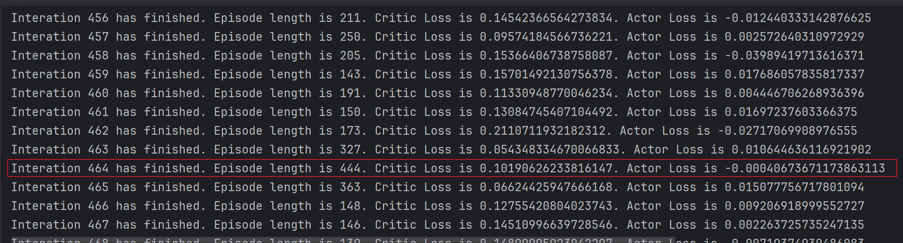

# 算法总结与对比

> 强化学习的算法旨在寻找该环境下的最优策略

## 0.Bellman Optimality Equation(BOE)

> 贝尔曼最优公式是贝尔曼公式的一个特例，用于描述最优策略的特性。贝尔曼公式对应一个给定的策略，而贝尔曼最优公式对应的给定策略为最优策略。

贝尔曼最优公式揭示了最优策略下的状态值函数与下一个状态的状态值函数之间的关系（elementwise
form）。其右端项最大化的属性表明在最优策略下，对于任意状态s，其状态值等于该状态下的最大动作值。因此，根据最优策略的定义（基于状态值函数），可获得贪心最优策略。

Contraction Mapping Theorem回答了以下重要问题：

- 对于任意状态值函数，是否存在一个最优策略使得该状态值函数满足贝尔曼最优公式？
- 贝尔曼最优公式的解是否唯一？对应的最优策略是否唯一？
- 如何求解贝尔曼最优公式？能否给出一种最优策略的形式？

贝尔曼最优公式是强化学习的核心，本笔记中包含的算法全部围绕贝尔曼最优公式展开。

## 1.Model-based Algorithms

该类算法通过对环境的建模来学习最优策略，即通常状态转移矩阵和奖励函数已知，无需通过采样来学习环境。
算法可分为两类：值迭代算法（Value Iteration）和策略迭代算法（Policy Iteration）。

总结来讲，

- 值迭代算法通过迭代方法求解贝尔曼最优公式，得到最优状态值函数，再根据最优状态值函数得到最优策略。
- 策略迭代算法在每一步Policy Evaluation中通过迭代求解贝尔曼公式得到当前策略下的状态值，再通过Policy
  Improvement得到新策略，直至收敛。（本质上也是求解贝尔曼最优公式）

### 1.1.Value Iteration

### 1.2.Policy Iteration

## 2.Model-free Algorithms

### 1.Monte-Carlo Methods

与预先知道状态转移概率和奖励不同，蒙特卡洛方法通过经验学习。
其核心思想是通过对轨迹（trajectory）的回报求平均来估计状态值。因此，蒙特卡洛方法的核心问题实质上是期望估计问题。
根据大数定律，当样本数趋于无穷时，蒙特卡洛方法的估计值收敛于真实值。因此，蒙特卡洛方法的关键在于如何有效地利用有限的样本来估计真实值。这涉及以下两个问题：

- 如何保证每一个‘状态-动作’对被访问足够多次数？即**每一个‘状态-动作’对被充分探索**
- 如何提高策略更新的效率？

#### 1.1. Monte-Carlo Basic Model

在策略迭代方法中的策略评价环节，通过充分采样，计算轨迹回报的均值作为动作值的无偏估计。在策略改进环节，根据动作值函数选择最优动作，更新策略。
与Model-based Policy Iteration算法类似，在策略迭代的过程中，策略评价和策略改进交替进行，直至收敛。

即使该方法易于实施，但仍存在以下**缺点**：

- 估计效率较低，需要等待全部样本采样完毕后才能进行策略改进
- 该估计方法是无偏的，但方差较大，需要大量样本才能收敛

#### 1.2. Exploring Starts

相较于Basic MC算法中的传统采样和策略更新方法，Exploring Starts方法通过以下两种方法分别提高**_采样效率_**和**
_策略更新效率_**：

- 每一个episode中包含了不同的‘状态-动作’对，因此为了提高样本的利用效率：（1）first-visit方法将由首次出现的‘状态-动作’对出发的truncated
  trajectory作为该‘s-a’对的样本；（2）every-visit方法将所有从该‘s-a’对出发的truncated trajectory作为该‘s-a’对的样本。
- **Generalized Policy Iteration(GPI)**方法将策略评价和策略改进交替进行，即牺牲估计的精确性，而是基于观察的粗略估计来提升策略更新的效率。

该方法存在以下**缺点**：

- 在实际中难以保证每一个‘状态-动作’对均被访问足够多次/充分探索

#### 1.3. $\epsilon$-Greedy Policy

在Exploring
Starts方法中，策略改进环节通过贪心策略选择最优动作。然而，贪心策略可能导致策略陷入局部最优解，因此引入$\epsilon$-Greedy的soft策略。（下图[引自书中](https://github.com/MathFoundationRL/Book-Mathematical-Foundation-of-Reinforcement-Learning/blob/main/3%20-%20Chapter%205%20Monte%20Carlo%20Methods.pdf)）

_Question 1: 蒙特卡洛方法是on-policy算法还是off-policy算法？上述Model-based算法是on-policy算法还是off-policy算法？_

_Question 2: 蒙特卡洛方法是online算法还是off-line算法？_

### 2.Temporal Difference Learning

前述的Monte-Carlo方法需要在每一个episode采样结束后才能进行策略更新，因此效率较低。时序查分（**_TD_**
）方法通过在每一个时间步进行策略更新，提高了策略更新的效率。

#### 2.1. Sarsa

Sarsa算法是一种基于时序差分的策略迭代算法，其核心思想是通过在每一个时间步更新策略，提高策略更新的效率。

> 在此指出，无模型策略迭代算法中，需要解决的核心问题是‘**Policy Evaluation**’，即如何估计出动作值。相比于Monte-Carlo算法中*
> *基于大数定律**的方法，Sarsa算法提供了一种**随机近似**的期望估计方法来**求解贝尔曼公式**。

- _Question：Sarsa算法的命名逻辑？Sarsa算法依赖的样本长什么样子？_
- _Question：Sarsa算法中动作值收敛的理论依据是什么（算法）？_
- _Question：Sarsa是online算法还是off-line算法？_
- _Question：Sarsa是on-policy算法还是off-policy算法？_
- _Question：Sarsa体现了什么思想？（**Generalized Policy Iteration**）_
- _Question：Sarsa在数学意义上解决了什么问题？与贝尔曼公式有什么联系？_

> $$
> q_{\pi}(s,a) = E(R+\gamma * q_{\pi}(s^{'},a^{'}))
> $$
>
> 贝尔曼公式是一种递归关系，既可以用状态值表示，也可以用动作值表示。

> 观察Sarsa的动作值更新公式，根据矩估计的无偏性和有效性两方面提高Sarsa算法的估计质量，衍生出Expected Sarsa和n-steps
> Sarsa算法。

#### 2.2. Expected Sarsa

- 优点：Expected Sarsa相较于Sarsa算法，通过去除‘经验’中的下一状态动作这一随机变量的观察，来降低估计的方差，提高估计的‘**有效性
  **’从而提高估计的精确性。

#### 2.4. N-steps Sarsa(truncated sampling思想)

- 优点：N-steps Sarsa通过n步采样，扩大样本规模，从而提升估计的‘**无偏性**’。

#### 2.5. Q-Learning

Q-Learning通过求解**贝尔曼最优公式**直接得到最优策略。

_Q-Learning是on-policy算法还是off-policy算法？_

### 3. 时序差分方法总结对比

书中[Section6,Chapter 7](https://github.com/MathFoundationRL/Book-Mathematical-Foundation-of-Reinforcement-Learning/blob/main/3%20-%20Chapter%207%20Temporal-Difference%20Methods.pdf)
给出如下表格对比各TD算法：

### 4. 近似算法(值近似和策略近似)

#### 4.1. Deep Q-Learning

Deep Q-Learning算法解决了tabular
Q-Learning算法状态空间过大时造成的维度灾难/存储空间爆炸的问题。DQN算法中引入了深度神经网络来近似Q值函数，通过经验回放和‘目标网络-主网络’的双网络训练方式来提高算法的稳定性和收敛性。

- 经验回放：通过从经验池中均匀随机采样构造训练样本批次，来满足常用的MSE损失函数要求的均匀分布假设。（否则采样过程服从‘稳态分布’（stationary
  distribution）。）
- 目标网络-主网络：通过固定目标网络的参数，减少目标值的波动，提高算法的稳定性。

> 注：书中讲解此处时，是通过‘max’函数难以求导的问题引出的，我个人认为这是一个较容易理解的方式，但是认为这并不是‘双网络’最大的优势（回想在卷积神经网络中的最大池化操作是如何通过bp求导的呢）。因此，我更倾向于从缓解TD
> Target中的max操作带来的‘高估’现象来解释引入‘双网络’的必要性。可具体参考以下两博客：[(1)](https://blog.csdn.net/weixin_51602120/article/details/128883464)
> 和[(2)](https://blog.csdn.net/qq_40206371/article/details/124991007)

_Question：目标网络参数与主网络参数‘对齐’的频率对于训练结果有无影响？应该如何设置？过高的对齐频率和过低的对齐频率各有什么不足？_

- _Question：DQN算法是on-policy算法还是off-policy算法？_

以下三图分别展示了

- （1）Main Network预测的最优策略对应的状态值
- （2）同一环境下的最优策略对应的状态真值
- （3）a.各‘状态-动作’对的访问次数；b.DQN训练过程的损失函数变化；c.训练过程中最优策略对应的状态值真值与预测值间误差。

#### 4.2. Policy Gradient Methods

根据书中给出的[Theorem 9.1~9.3](https://github.com/MathFoundationRL/Book-Mathematical-Foundation-of-Reinforcement-Learning/blob/main/3%20-%20Chapter%209%20Policy%20Gradient%20Methods.pdf)
，我们将三种不同的optimization metric的梯度表达式列举如下：

> 注：此处我们仅考虑贴现(discounted case)情况，读者可根据实际情况参考书中给出的未贴现(undiscounted case)情景分析

| metric                                | derivative of the metric                                                                                                                            |
| ------------------------------------- | --------------------------------------------------------------------------------------------------------------------------------------------------- |
| general case$J(\theta)$               | $\nabla_{\theta}J(\theta)=\sum \eta(s)\sum\nabla_{\theta}\pi(a\|s,\theta)q_{\pi}(s,a)=E(\nabla ln \pi(a\|s,\theta)q_{\pi}(s,a))$                    |
| $\bar v_{\pi}^0=d_0^Tv_{\pi}$         | $\nabla_{\theta} \bar v_{\pi}^0=\sum d_0(s^{'})[(I-\gamma P_{\pi})^{-1}]_{s's}\sum \pi(a\|s,\theta)\nabla_{\theta}ln{\pi}(a\|s,\theta)q_{\pi}(s,a)$ |
| $\bar v_{\pi}=d_{\pi}^T \bar v_{\pi}$ | $\nabla_{\theta} \bar v_{\pi}=(1-\gamma)^{-1} \sum d_{\pi}(s)\sum \nabla_{\theta}\pi (a\|s,\theta)q_{\pi}(s,a)$                                     |
| $\bar r_{\pi}=d_{\pi}^T \bar r_{\pi}$ | $\nabla_{\theta} \bar r_{\pi}= (1-\gamma) \nabla_{\theta} \bar v_{\pi} $                                                                            |

> 注：上表中的$\eta(s),d_0(s),d_{\pi}(s)$表示状态$s$服从的不同分布
>
> *当未知或无法直接求得随机变量服从的真实分布时，可以利用随机梯度下降通过采样来估计期望。*

##### 4.2.1. REINFORCE算法

当利用*随机梯度*方法来估计期望时，若通过*Monte-Carlo*方法采样估计动作值，则该算法被称为REINFORCE算法。

> 我们在Grid

World中测试PG算法，共进行500轮迭代，给定起始位置与终点位置，旨在求解两点之间可行的一条最优路径。由于PG算法十分不稳定，且训练过程中容易出现梯度爆炸等问题（因奖励函数设置不当以及$log$项的存在），因此在训练过程中我们将学习率设置成为阶段性衰减，避免PG算法容易陷入局部最优的特点带来的较差结果。

下图一中的上图展示了训练过程中的*criteria*的收敛曲线。需要注意的是，此处我并未称之为loss
function，因为该优化目标的构建并不严格符合损失函数的定义（由图中曲线也可看出）。接下来我们着重分析在该环境下，为什么优化目标的收敛曲线会呈现如下形状。

优化指标的数学表达式为：$-log(\pi(a\|s,\theta)q_{\pi}(s,a)$。当策略逐渐收敛至最优策略时，由于PG算法为*on-policy*
算法，因此behavior policy会越来越靠近target
policy，从而使得中间项会逐渐趋近于0，因此整体趋近于0；并且在此过程中，由于前两项乘积非负，因此动作值逐渐收敛至最优的过程中递增，故呈现如下曲线形状。最终deterministic
optimal greedy policy如下图二所示，给出了一条连接起始位置和终点未知的最优路径。

下图一中的下图展示了给定起始位置和终点位置后的Monte-Carlo采样的样本大小，即episode长度。当episode越短时，说明此时策略距离最优策略越近。

> 不建议使用PG算法，因为不稳定，容易陷入局部最优。

##### 4.2.2. Actor-and-critic(A2C)

A2C算法可以看作是传统PG算法的一种扩展，引入了value-based方法。

1. 当我们采用一个函数来近似动作值并利用TD算法（随机梯度下降）来拟合该函数时，该方法被称为*QAC算法*。

   *Question：思考如果用一个神经网络来拟合该函数，应该将优化目标设置成什么？*

   > 在实际应用中，REINFORCE和QAC由于估计的方差较大，因此效果并不好
   >

2. **Advantaged Actor-and-Critic（A2C）**

A2C算法通过在’动作值‘的估计中引入偏置量来降低**SGD**中对于梯度估计的方差，**近似最优**偏置量为状态值$v_{\pi}(s_t)$
下图中展示了A2C算法在openai的gym环境库的’CartPole-v1‘环境中的测试结果，可以看到在迭代后期，木棍在小车上的滞留时间逐渐趋于阈值，训练效果较好

##### 4.2.3. Off-Policy Actor-Critic

_Question:off-policy
actor-critic算法的优点是什么？为什么要提出off-policy算法？**（Hint：强化学习要解决的本质问题是exploration-exploitation）**_

> 注：在实践中，由于Off-Policy Actor-Critic算法中actor和critic参数更新的步长中含有
>
> $$
> \frac{\pi(a_t\|s_t,\theta_t)}{\beta(
> a_t\|s_t)}
> $$
>
> 因此当采样策略与优化策略差距过大时（尤其当因此当采样策略与优化策略差距过大时（尤其当$\pi(\theta)与\beta$差异较大时，参数更新公式中的重要性因子会导致梯度爆炸），算法效果不佳（可以考虑PPO对优化目标添加正则项裁切梯度，或考虑DPG避免对动作值进行直接采样）

##### 4.2.4. Deterministic Policy Gradient(DPG)

DPG算法优点：

- 能够处理具有无限元素的动作集合，提高算法的泛化性与训练效率
- 由于无需直接对动作进行采样，因此是off-policy算法，同时能够避免重要性因子过大导致的梯度爆炸（不恰当的采样策略会导致其与目标策略之间的分布间差异过大）
  - 原因：DPG算法利用梯度上升优化的目标函数表达式为：

    $$
    E(\nabla_{\theta}\mu(S)(\nabla_aq_S,a=\mu(S)))
    $$

    可以观察到**真实梯度中并不包含对动作值的采样**（取而代之的是由Actor Net直接输出的动作值估计），因此是off-policy算法

_Question：DPG在数学意义上解决什么问题？与前述stochastic policy gradient算法的critic求解的数学问题有什么不同？（Hint：观察TD
Error）_

> 注：考虑到DPG中Actor的输出为动作本身，因此选择gym提供的具有连续动作空间的Pendulum环境进行测试

> 思考：
>
> 1. On-policy和Off-policy分别适用于解决什么类型的任务？为什么？
>    *答：On-policy适合解决给定起始状态和终点状态之间最优‘路径’一类问题，Off-policy适合求解任意状态的最优策略。这是由于On-policy算法的behavior
>    policy和target policy是同一个，因此无法保证充分地探索每一个‘状态-动作’对；而Off-policy算法的前述两类policy并非同一个，因此可以选择随机性较强的behavior
>    policy（例如均匀随机策略）来充分探索。*
> 2. Online和Offline算法分别适用于解决什么类型的任务？为什么？*答：Online算法适合样本量较少情况下的学习任务，诸多算法都利用了Generalized
>    Policy
>    Iteration的思想，效率较高；Offline算法适合已经拥有大量样本的情况，因为利用模拟仿真的方法（例如，Monte-Carlo）采样效率较低。*
